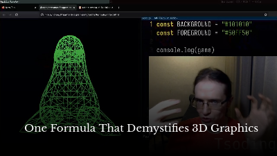
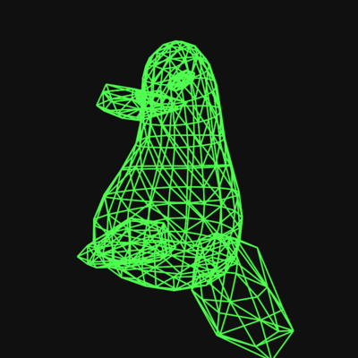

# "One Formula That Demystifies 3D Graphics"

Source Code from this [YouTube Video](https://www.youtube.com/watch?v=qjWkNZ0SXfo). Just open [index.html](./index.html) in a Browser. Or go to [https://tsoding.github.io/formula/](https://tsoding.github.io/formula/)

Demo that you can try (input your .obj or .glb): https://3dview.nizav.workers.dev/
The Source Code from this YouTube Video:

[](https://www.youtube.com/watch?v=qjWkNZ0SXfo)

## Quick Start

```console
$ git clone https://github.com/tsoding/formula
$ cd formula
$ iexplore.exe ./index.html
```

The repo is also deployed to GitHub Pages: [https://tsoding.github.io/formula/](https://tsoding.github.io/formula/)

[](https://tsoding.github.io/formula/)

## Model

The model is provided by [https://github.com/Max-Kawula/penger-obj](https://github.com/Max-Kawula/penger-obj)

[](https://github.com/Max-Kawula/penger-obj)
